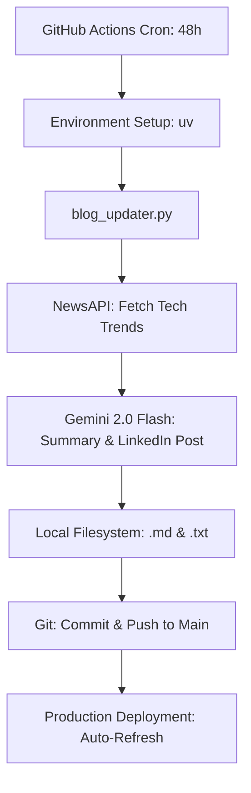

# 🚀 AI-Driven Portfolio Engine

[](https://github.com/wolflergf/portfolio_flask/actions/workflows/main.yml)
[](https://www.python.org/)
[](https://github.com/astral-sh/uv)
[](https://opensource.org/licenses/MIT)

A high-performance, autonomous portfolio and blog ecosystem built with **Flask 3.0**, powered by **Google Gemini 2.0 Flash**, and orchestrated via **GitHub Actions**. This isn't just a website; it's a self-sustaining content engine.

**🔗 Live Site:** [wolflergf.com](https://wolflergf.com)

---

## 💎 Core Philosophy

This project showcases the intersection of **Software Engineering** and **Autonomous AI**. It is designed to be low-maintenance and high-impact, featuring a "self-healing" architecture that automates content curation, technical summarization, and social media outreach.

### Key Features
- **🤖 Autonomous AI Blog**: Every 48 hours, a background worker fetches trending tech news via NewsAPI, synthesizes high-quality technical summaries using Gemini 2.0 Flash, and commits them directly to the repository.
- **⚡ Modern Tech Stack**: Built with Flask 3.0, leveraging `uv` for lightning-fast dependency management and deterministic environments.
- **🎨 Sleek UI/UX**: A responsive, dark-mode-first aesthetic inspired by the *Everforest* palette, focusing on typography and readability.
- **🛡️ Secure Communications**: Production-ready contact form with CSRF protection and Flask-Mail (SMTP) integration.
- **📈 SEO & Social Ready**: Dynamic OpenGraph tags, Twitter Cards, and automated LinkedIn post generation for every blog update.

---

## 🏗️ Architecture & Data Flow

The system operates as a closed-loop autonomous engine:



1.  **Ingestion**: The system polls global tech news for high-signal articles.
2.  **Processing**: Gemini 2.0 Flash acts as a technical editor, transforming raw news into first-person technical insights.
3.  **Persistence**: The worker uses a resilient Git-push strategy to commit new content as Markdown, ensuring the repository remains the single source of truth.
4.  **Distribution**: Simultaneously generates LinkedIn-ready drafts to streamline professional networking.

---

## 🛠️ Local Development

This project uses [uv](https://github.com/astral-sh/uv) for Python package management. It is significantly faster and more reliable than traditional `pip` workflows.

### Prerequisites
- Python 3.12+
- `uv` installed (`powershell -c "irm https://astral.sh/uv/install.ps1 | iex"`)

### Setup
1. **Clone the repository:**
   ```bash
   git clone https://github.com/wolflergf/portfolio_flask.git
   cd portfolio_flask
   ```

2. **Initialize environment & install dependencies:**
   ```bash
   uv sync
   ```

3. **Configure Environment Variables:**
   Create a `.env` file in the root directory:
   ```env
   FLASK_SECRET_KEY=your_secret_key
   NEWS_API_KEY=your_newsapi_key
   GEMINI_API_KEY=your_gemini_key
   MAIL_SERVER=smtp.gmail.com
   MAIL_PORT=587
   MAIL_USE_TLS=True
   MAIL_USERNAME=your_email
   MAIL_PASSWORD=your_app_password
   ```

4. **Run the application:**
   ```bash
   uv run flask run
   ```

---

## 🤖 AI Automation Commands

You can trigger the content engine manually using `uv`:

- **Run Mock Update (Test AI Generation):**
  ```bash
  uv run utils/mock_updater.py
  ```
- **Run Full Production Sync:**
  ```bash
  uv run utils/blog_updater.py
  ```

---

## 📁 Project Structure

```text
portfolio_flask/
├── data/               # Persistent JSON & Markdown content
│   ├── blog_posts/     # AI-generated .md files
│   └── projects.json   # Portfolio project definitions
├── static/             # Assets (CSS/JS/Images)
├── templates/          # Jinja2 HTML templates
├── utils/              # AI Logic & Automation scripts
├── .github/workflows/  # CI/CD & Cron Job definitions
├── app.py              # Main Flask Entrypoint
└── pyproject.toml      # Modern dependency configuration
```

---

## 📄 License

Distributed under the MIT License. See `LICENSE` for more information.

---

**Developed with 🦀 and 🦞 by [Wolfler](https://github.com/wolflergf)**
